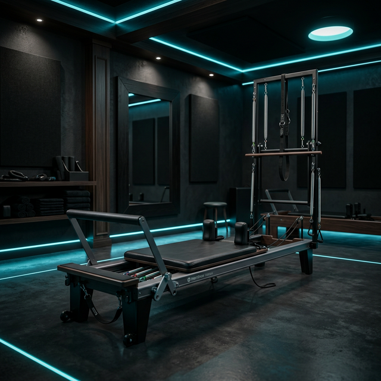

# Aura Flow Fit - Premium Landing Page

Una landing page "Dark Luxury" diseñada para un gimnasio y estudio de Pilates Reformer exclusivo.

## 🎨 Estilo y Personalización

El diseño utiliza una paleta oscura con acentos en color **Calypso (#06B6D4)**.

### Colores Principales
- **Fondo**: Negro (#000000) y Gris Oscuro (#09090B)
- **Acento**: Calypso (#06B6D4)
- **Texto**: Blanco (#FFFFFF) y Gris Claro (#E4E4E7)

### Tipografía
- **Títulos**: Plus Jakarta Sans (Moderna, audaz)
- **Cuerpo**: Inter (Legible, limpia)

## 📁 Estructura del Proyecto

```
/aura_flow_fit
  ├── index.html      # Estructura principal
  ├── styles.css      # Estilos y animaciones
  ├── script.js       # Interacciones (Menú, contadores, flip cards)
  ├── README.md       # Documentación
  └── images/         # Carpeta para imágenes (actualmente placeholders)
```

## 🖼️ Reemplazo de Imágenes (Placeholders)

Actualmente la web usa "placeholders" (cuadros de color) porque el servicio de generación de imágenes no estaba disponible. Para completar la web, debes reemplazar las siguientes referencias en el código o añadir los archivos a la carpeta `images/`:

1.  **Logo**: `images/logo.png` (Tamaño recomendado: 512x512px, fondo transparente)
2.  **Hero**: `images/hero_visual.png` (Visual 3D abstracto o foto de alta calidad, fondo transparente recomendado)
3.  **Servicios**:
    - `images/service_1.png`: Pilates Reformer
    - `images/service_2.png`: Personal Training
    - `images/service_3.png`: Wellness & Recovery
    - `images/service_4.png`: Grupos Exclusivos
4.  **Showcase**: `images/showcase_1.png` (Interior del gimnasio)
5.  **Equipo**: `images/about_image.png` (Foto del equipo o instructores)

### Cómo activar las imágenes en HTML
Busca en `index.html` las líneas comentadas como esta:
```html
<!--  -->
```
Y descoméntalas (quita `<!--` y `-->`) una vez tengas las imágenes.

## ✨ Características Interactivas

- **Flip Cards**: Pasa el mouse (o toca en móvil) sobre las tarjetas de servicio para ver más detalles.
- **Glassmorphism**: Efecto de vidrio esmerilado en tarjetas y navbar.
- **Partículas**: Fondo animado sutil.
- **Contadores**: Animación de números en la sección Hero.
- **Responsive**: Adaptado a Móvil, Tablet y Desktop.
